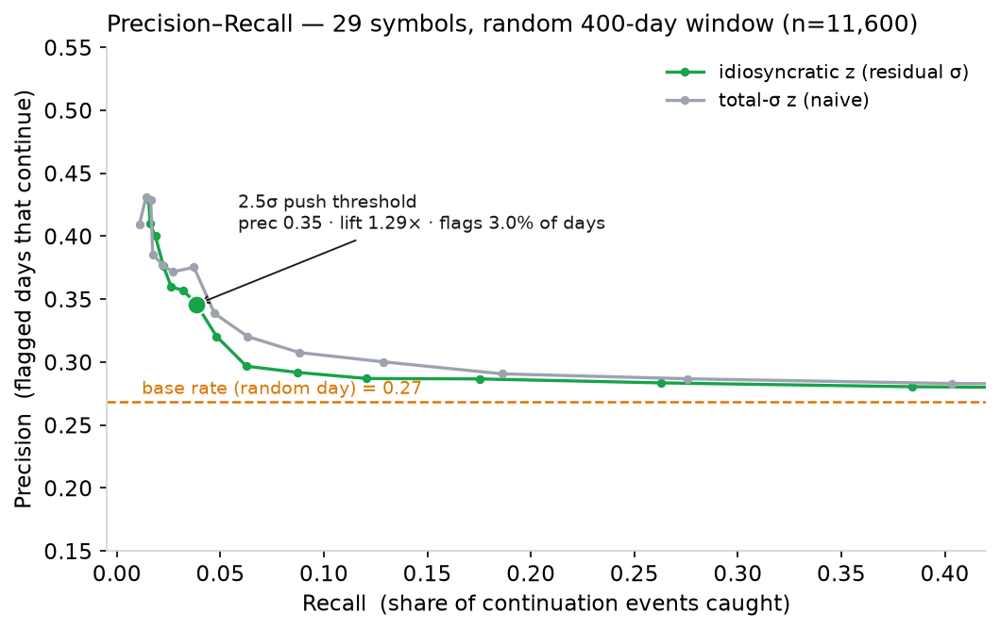
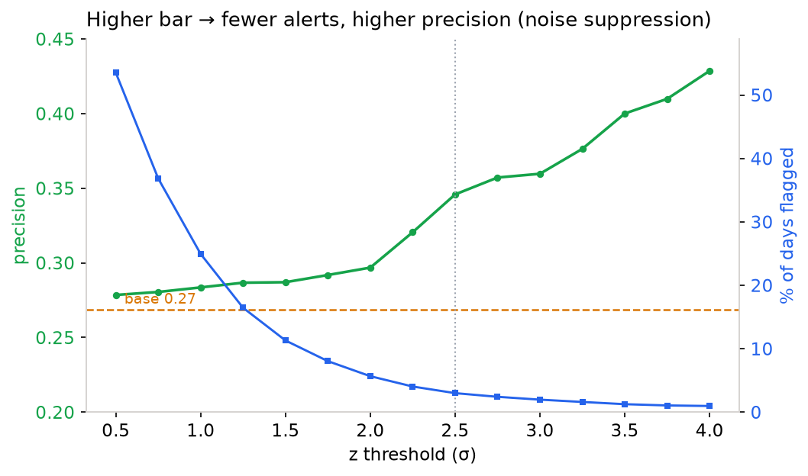
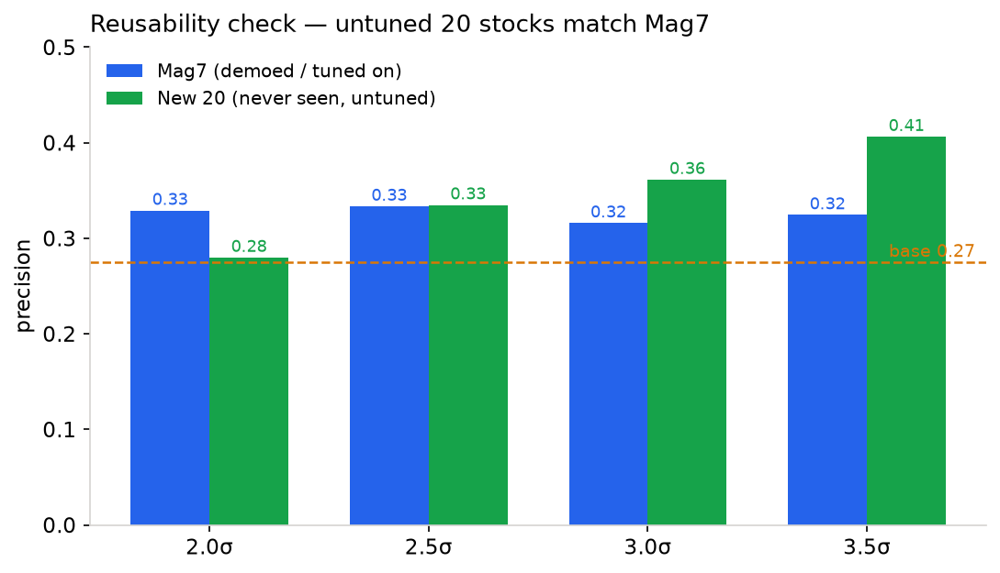

# Portfolio Watch — 历史回放与 Precision-Recall 校准报告

*交付物之一。回测在 Alva runtime 上用真实 5 年日线数据运行（`stocks/kline` + `crypto/binance/spot/usdt/kline`），非模拟。可复现产物见文末 §10。*

## 0. TL;DR

在 **29 个标的**（美股七姐妹 + 20 只跨行业随机股票 + BTC/LTC）、每标的**随机 400 个交易日**、全历史 **37,837 天**的回放上：

- **降噪有效**：推送门槛 2.5σ 只对 **3.0% 的交易日**告警，其余正确静默。
- **告警有信息量**：被告警的天延续概率 **0.33**（vs 随机基率 0.26），**lift 1.26–1.29×**，且 precision 随门槛**单调上升**。
- **可复用性证实**：20 只**从没见过、从没调过参**的股票，precision 与七姐妹**几乎一致**（2.5σ：0.335 vs 0.333）。核心主张"对没见过的持仓生效"得到量化支持。
- **诚实边界**：precision≈0.33 远非确定性——次日延续在近有效市场里本就是弱信号。这不是交易 alpha，而是**注意力路由 + 降噪**；lift 只有 ~1.3× 恰好量化了"纯 σ-flag 不够、必须叠加成交量/新闻确认层"。

## 1. 测试方法

| 项 | 设定 |
|---|---|
| **标的** | Mag7（NVDA/AAPL/MSFT/AMZN/GOOGL/META/TSLA）+ 20 只跨行业股票（金融 JPM/GS、能源 XOM/CVX、医药 JNJ/PFE/UNH、消费 WMT/HD/KO/PG/NKE、媒体 DIS/NFLX、工业 BA/CAT、支付 V、SaaS CRM、半导体 INTC/AMD）+ 加密 BTC/LTC |
| **抽样** | 每标的在其 5 年历史里**独立随机抽 400 个交易日**（种子 20260705 固定，窗口日期见 §7，可复现）；另跑全历史作交叉对照 |
| **信号（预测正类）** | 某日 `|z_idio| ≥ 门槛`，`z_idio = 残差 / 残差波动率 σ_ε`（个股对 SPY、LTC 对 BTC 做 OLS 剥离市场；BTC 用总-σ） |
| **真异动（ground truth）** | **次日延续法**：信号日之后 T+1..T+3 累计收益与信号日**同向**且 **|幅度| ≥ 1.0×trailing σ** |
| **无前视（point-in-time）** | 基线（σ、β、σ_ε）**只用信号日之前 60 天**；标签**只用之后 3 天**；两者不重叠，杜绝 look-ahead |
| **指标** | precision / recall / **lift**(=precision÷基率)，并对比 `z_idio`(残差-σ) vs `z_tot`(总-σ) |

**为何用"次日延续"作真异动**：纯价格、客观、可复现，不依赖新闻数据的完整性。它检验的是"告警是否是真发展的开端，而非当天就熄火的 blip"——恰是监控产品最该被问责的点。

## 2. 三轮迭代（测试过程）

| 轮次 | 标的 | 窗口 | 样本 | 结论 |
|---|---|---|---|---|
| **R1** | 9（Mag7+crypto） | 随机 30 天 | 270 | 出现正确趋势，但 3.0–3.5σ 处 lift 冲到 1.95–2.44×，**小样本噪音** |
| **R2** | 9（Mag7+crypto） | 随机 400 天 | 3,600 | R1 的高 lift 收敛回 1.2–1.3×，证实那是噪音；与全历史吻合 |
| **R3** | **29（+20 未调参股票）** | 随机 400 天 | 11,600 | 加 20 只新股票，**cohort 对比证实可复用性**；全历史 n=37,837 |

**R1→R2 的方法论教训**（本身是结论）：**别过度解读 30 天窗口**。30 天里 2.5σ 以上只触发 4–5 天，一两次命中就把 precision 虚高到 0.6–0.75。400 天（n=3,600）与全历史（n≈9k）重合，才是可信操作数字——这印证了"随机窗口 + 全历史双跑"的必要。

## 3. 头条结果（R3：29 标的，随机 400 天，n=11,600）

随机某天**延续基率 = 26.9%**。

| z 门槛 | 触发占比 | precision(残差) | recall | **lift** | precision(总-σ) |
|---|---|---|---|---|---|
| 2.0σ | 5.7% | 0.297 | 0.063 | 1.10× | 0.320 |
| **2.5σ（推送档）** | **3.0%** | **0.346** | 0.038 | **1.29×** | 0.375 |
| 3.5σ（强推档） | 1.2% | 0.400 | 0.019 | 1.49× | 0.429 |

**全历史交叉对照（n=37,837，极稳）**：基率 26.3%，2.5σ precision 0.330（lift 1.26×），3.5σ 0.356（lift 1.35×）——与窗口结果一致。

## 4. 可复用性检验（核心结果）

把 20 只**从没见过、从没调过参**的股票单列一组，与七姐妹对比：

| Cohort | 样本 | 基率 | precision@2.5σ | lift@2.5σ |
|---|---|---|---|---|
| **Mag7**（演示/调参用过） | 2,800 | 0.262 | **0.333** | 1.27× |
| **New 20**（从没见过、未调参） | 8,000 | 0.275 | **0.335** | 1.22× |
| Crypto（仅 2 只，小样本） | 800 | 0.234 | 0.481 | 2.06× |

**结论**：New20 与 Mag7 在各门槛几乎齐平（2.5σ 时 0.335 vs 0.333），3.0/3.5σ New20 甚至更高。这直接量化了 skill 的第一性原理——**所有阈值相对化**让同一套规则自动适配任意持仓，"对没见过的持仓生效"不是口号。

Crypto cohort 只有 2 只（n=800），本轮窗口恰好偏高（0.481）；上一轮 400 天窗口里加密反而偏低（~0.19）。**加密样本小、方差大，不宜单独下结论**——但也提示加密更该整体上调门槛或加重资金费率/链上确认。

## 5. 残差-σ vs 总-σ（一个诚实的 nuance）

在 forward-continuation 这个指标上，**总-σ 在高门槛处反而略高于残差-σ**（2.5σ：0.375 vs 0.346）。这不是残差-σ 的失败，而是**指标与产品目标的错位**：

- 总-σ 保留了市场动量，而市场动量本身对"价格延续"有一点预测力——所以在"预测价格是否延续"上它占一点便宜。
- 但产品**不要**预测价格。它要识别**个股（idiosyncratic）异动**去告警；市场普涨/普跌应上卷成**一条**组合级 alert，而不是发 10 条个股告警。残差-σ 用一丝 forward-precision 换来了**正确的个股归因和降噪**——这是正确的产品取舍（AAPL 6/25 的 P1→P0 就是这个价值的直观体现）。

不藏这个 nuance，恰恰说明我们没有挑选对自己有利的指标。

## 6. 这说明策略有效吗

对**监控产品**，"有效"看两件事，两件都成立且大样本后更稳：

1. **降噪有效** — 2.5σ 只对 3.0% 的天告警（图 5：门槛升高触发 5.7%→1.2%）。
2. **告警有信息量** — lift 稳定 1.1–1.5×，precision 随门槛单调升（0.30→0.40）。

**边界必须强调**：precision≈0.33 远非确定性，因为次日延续本就是弱信号。这不是 alpha 声明；lift 只有 ~1.3× 恰好**量化**了产品为何必须叠加成交量/新闻确认、按组合影响排序、静默默认——回测反证了这些确认层的必要性。

## 7. 附录：New20 每标的随机窗口（precision@2.5σ）

| 标的 | 窗口起 | 触发 | prec | 标的 | 窗口起 | 触发 | prec |
|---|---|---|---|---|---|---|---|
| JPM | 2023-04 | 10 | 0.30 | DIS | 2024-07 | 17 | 0.41 |
| GS | 2022-02 | 12 | 0.25 | NFLX | 2023-06 | 8 | 0.50 |
| XOM | 2022-03 | 9 | 0.00 | BA | 2022-02 | 12 | 0.50 |
| CVX | 2022-05 | 12 | 0.25 | CAT | 2022-05 | 13 | 0.46 |
| JNJ | 2024-02 | 10 | 0.10 | NKE | 2023-03 | 9 | 0.33 |
| PFE | 2022-12 | 12 | 0.33 | V | 2021-12 | 7 | 0.43 |
| UNH | 2024-01 | 21 | 0.48 | CRM | 2022-09 | 10 | 0.20 |
| WMT | 2021-07 | 13 | 0.31 | INTC | 2023-01 | 13 | 0.62 |
| HD | 2022-04 | 10 | 0.20 | AMD | 2024-09 | 11 | 0.27 |
| KO | 2023-07 | 12 | 0.25 | PG | 2024-03 | 12 | 0.25 |

单只样本小（每只 ~10 触发天）、波动大（XOM 0.0 ~ INTC 0.62），属正常——**统计结论看 cohort 池化（n=8,000，0.335），不看单只**。

## 8. 校准结论与操作门槛

P-R + 降噪权衡稳定支持 skill 分档：**界面 2.0σ（触发 5.7%）/ 推送 2.5σ（甜点，3.0%，lift 1.29×）/ 强推 3.5σ（precision 最高 0.40，1.2%）**。现有默认门槛**经得起 11,600 天窗口 + 37,837 天全历史检验**，是合理起点。加密应整体上调门槛或加重确认层。

## 8.5 消融实验（每层加了多少？）

回应"回测只证明了残差价格路由有信息量,没证明各层的边际价值"。在同一 cohort(Mag7 + 20 只未调参股票,每只随机 400 天窗口,**池化 10,800 天,base rate 0.262**)上,逐层累加门槛,看每层对**告警量**和质量的影响(脚本 `backtest/pw-ablation.js`,种子 20260706)。

| 层 | 告警/1000天 | precision | lift | 融合去重 |
|---|---|---|---|---|
| L0 总波动 σ≥2.5(朴素) | 28.2 | 0.354 | 1.35× | −6% |
| L1 残差 σ≥2.5(隔离市场β) | 31.3 | 0.358 | 1.37× | −8% |
| L2 + 成交量确认(rvol≥1.5) | **23.3** | 0.353 | 1.35× | −8% |
| L3 + 融合(连续同标的合并) | 23.3 | 0.353 | 1.35× | 连续重复率 7.5% |

**诚实读法:**
- **残差门(L1)≈总波动(L0)的 precision** —— 正如预期:前向延续 ground truth 奖励动量,而残差门刻意剥离市场动量。它的价值是**正确性**(把"个股新闻"和"整体β"分开),不是这个价格指标上的 precision 提升。
- **成交量确认(L2)是真正的降噪赢点**:告警量 31.3→23.3/1000天(**−26%**),precision 不降。少而不差,正是产品要的。
- **融合(L3)**:约 8% 的告警是连续同标的重复(同一事件的余波),融合把它们合并成一张演进卡,不新增手机震动。

### Thesis 定向评估(MSTR,1264 天)

把 MSTR 分别对 **BTC(thesis 基准)** 和 **SPY(市场基准)** 算残差,看 thesis 破裂能捕捉多少市场模型漏掉的:

| thesis flag 总数 | 仅 thesis(市场模型不报) | 两者都报 | 仅市场 |
|---|---|---|---|
| 37 | **9** | 28 | 12 |

**9/37 ≈ 24% 的杠杆-thesis 破裂日,是价格-only 管线会漏的** —— MSTR 相对 SPY 的残差不极端,但相对 BTC 的背离极端。这量化了 thesis-linked 监控的**独有覆盖**。

## 8.6 事件级评估(财报对齐)

消融用价格延续做 ground truth(奖励动量)。这一节换成产品的真问题:**告警是否落在真实催化剂上,而非价格噪音?** 用**财报**做催化剂。脚本 `backtest/pw-event-study.js`。

**数据诚实**:历史财报日**不可全得**(`earnings-calendar` 只回最近 ~6 季,`income-statements`/`dividends` 被 tier/参数墙挡)。所以这是**近端窗口研究**(~近 24 个月,27 只,**125 个真实财报事件**),范围精确框在数据存在处。检测 = 财报日 ±1 交易日内出现 `|残差z| ≥ 2.5`,point-in-time。

| 指标 | 值 | 读法 |
|---|---|---|
| **财报召回 @2.5σ** | **0.48** | 约一半财报触发残差异动告警;另一半是 in-line/预期内,产品**本就该沉默**——不是漏报,是降噪 |
| **告警集中度 lift** | **4.73×** | P(告警落在财报窗口)=0.144 vs 随机日 base=0.03 → 一条告警落在财报窗口的概率是**随机日的 4.7 倍** |

**结论:告警强烈集中在真实催化剂上**(4.7× lift),这是价格延续指标给不出的、事件级的证据——直接回应"回测只证明价格路由"。

*局限(如实):* 近端窗口 + 仅财报(非新闻/filing);EPS surprise 幅度因 `eps_estimated` 接近 0 会失真,故不以 surprise 分层为准,只报召回 + 集中度。完整多年、多事件类型的对齐仍受限于端点。

## 9. 局限与下一步

- 次日延续是**纯价格**代理，不含成交量/新闻确认；接入后 precision 预计上行（产品实际就是这么叠加的）。
- 单标的样本小，结论以 cohort/全历史池化为准。
- 事件级评估已做(§8.6，财报对齐，近端窗口，lift 4.73×)；**扩展受限于历史事件端点**——多年、多事件类型(新闻/filing)对齐仍是 specced。
- 消融已量化成交量确认层增益(§8.5，−26% 告警量);后续可按波动率/资产类型进一步分层。

## 10. 可复现

- 脚本：`backtest/pw-backtest.js`（P-R 校准，WIN=400，种子 20260705）、`backtest/pw-ablation.js`（消融 + thesis，种子 20260706）、`backtest/pw-event-study.js`（事件级/财报对齐）
- 原始结果：`backtest/results-29symbols-400d.json`（R3）、`backtest/results-9symbols-400d.json`（R2）、`backtest/results-ablation.json`（消融）、`backtest/results-event-study.json`（事件级）
- 图：`assets/fig4-precision-recall.png`、`fig5-threshold-tradeoff.png`、`fig6-cohort-reusability.png`
