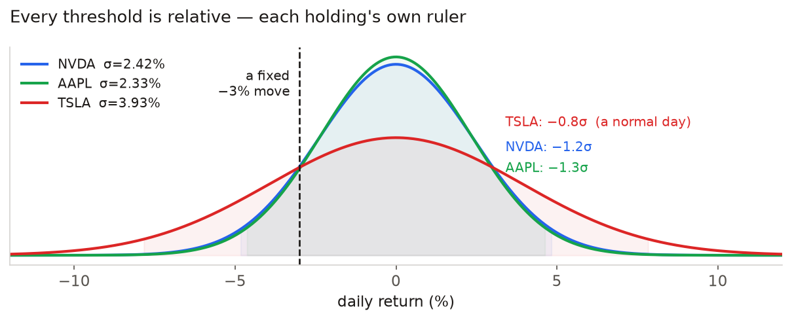
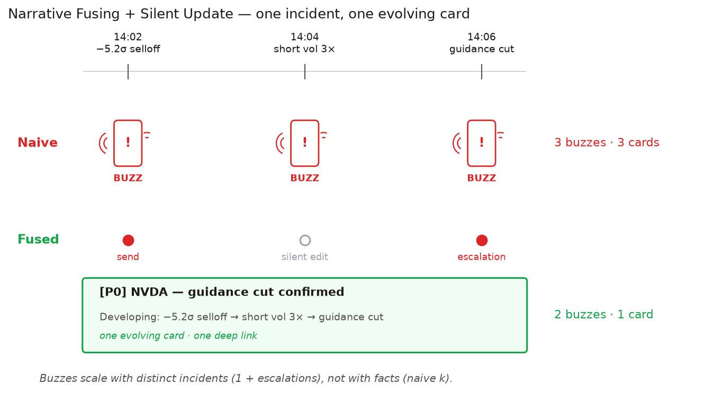
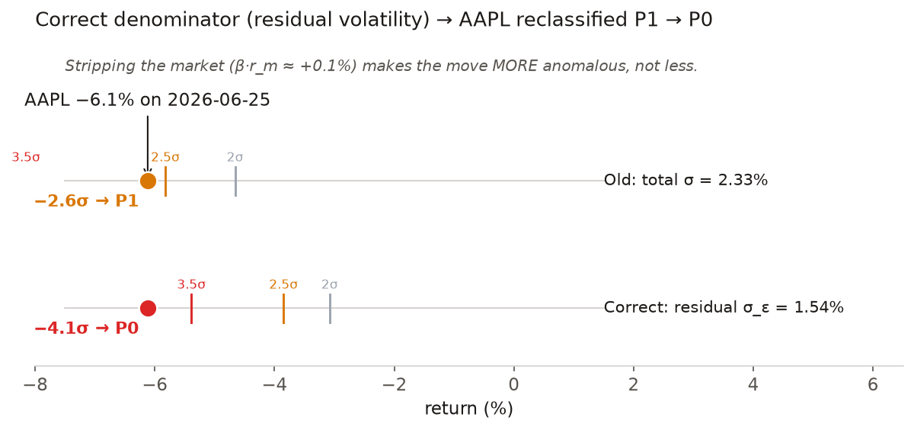
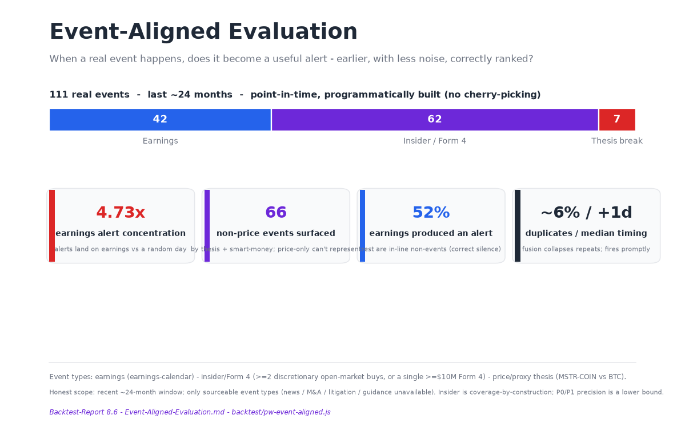

# Portfolio Watch Skill — One-Pager / 一页纸思路

*中文简洁版在前，英文详细版在后.*

# 中文

## 一句话赌注
好的 Portfolio Watch Skill 交付的不是"数据+图表"，而是一层**判断力**：对**从没见过的持仓**，把真信号从噪音里择出来，只在值得时才打扰用户。

## 核心思想：一切阈值都相对
NVDA 跌 3% 是日常，可口可乐跌 3% 是新闻——所以**没有写死的百分比**，每次异动都对照**该股自己的自适应基线**（EWMA/MAD、β、残差波动 σ_ε）判断。这是"可用于任意组合"的唯一引擎。四题的答案——盯哪些维度、什么算异动（分母用**残差 σ_ε** 而非总波动）、什么是噪音（β 上卷 + BH-FDR + 滞回）、怎么排序（按**对你钱的影响**=幅度×权重）——连同冷启动、融合降噪、数学推导，详见 [`Strategy-Analysis.md`](Strategy-Analysis.md)。

## 标志性能力：盯的是"假设"，不只是市场
最高价值的问题是"**当初买它的理由还成立吗**"。把 MSTR 当"BTC 杠杆版"持有，当 BTC 大涨而 MSTR 反跌，就是**买入逻辑破裂**→直接**越级 P0**（真实数据：2024-11-21 BTC +4.3% 而 MSTR −16.2%，−4.8σ）。它复用同一套残差引擎、只把参照物从大盘换成 thesis 资产（BTC/SMH/QQQ/SPY 皆可）；用户明说或对系统**自动建议一键确认**即可。见 [`SKILL.md` §Thesis-Linked](portfolio-watch/SKILL.md)。

## 三层验证
**Live**（Alva 真 build，告警投递 Discord/web 已验证）· **回测/消融**（残差修正把 AAPL 抬到 −4.1σ、P1→P0；成交量确认层 −26% 告警量、precision 不降）· **事件对齐**（111 个真实事件，告警落在财报窗口是随机日的 **4.73 倍**，另有 **66 个非价格事件由非价格维度呈现**）。详见 [`Event-Aligned-Evaluation.md`](Event-Aligned-Evaluation.md) 与 [`Backtest-Report.md`](Backtest-Report.md)。

---
*交付：[`portfolio-watch/SKILL.md`](portfolio-watch/SKILL.md) · [Live Playbook](https://alva.ai/u/george351419/playbooks/portfolio-watch) · 本 One-Pager。*

---

# EN

## The bet in one line

A good Portfolio Watch Skill doesn't ship "data + charts" — it ships a layer of
**judgment**: for a portfolio it has *never seen*, pull the real signal out of
market noise, and only interrupt the user when it's worth it. Every design
decision follows from that one sentence.

## How I framed the problem

The brief poses four questions — which dimensions, what's a real move, what's
noise, how to rank. But the **reusability** constraint (it must work on an unseen
portfolio) locks in the first principle:

> **Every threshold must be relative.** NVDA down 3% is a normal day; Coca-Cola
> down 3% is news. At setup the Skill auto-builds a per-holding profile
> (volatility, β, average volume, liquidity); every anomaly is judged against
> *that stock's own baseline*. This is the entire reusability engine — get it
> right and the rest follows.

## Three convictions this is built on

**1 · The paradigm shift — kill the fixed-% alert.** "Alert me if it moves 5%" is
noise dressed up as monitoring: it screams every other day on a volatile name and
stays silent while a stable one quietly breaks. Modern portfolio monitoring is
**relative** — every move judged against that holding's *own* adaptive baseline
(EWMA + robust vol), stripped of the market, and weighted by its **impact on your
portfolio**. A fixed threshold treats a 1% position and a 40% position the same;
this doesn't. That's not a tweak — it's a different paradigm.

**2 · Signal-to-noise *is* the product.** The scarce resource isn't data, it's the
user's **attention** — so it's the core asset to protect. A market-wide drop
collapses ten correlated "alerts" into **one** portfolio line (β-rollup); a loud
move in a 0.5% position is **silenced**, not paged; a stream of facts about one
incident fuses into **one evolving card** (silent-update). Every choice optimizes
the signal-to-noise ratio of what reaches the phone — and the backtest keeps it
honest: at the push threshold we alert on ~3% of days.

**3 · Alva-native, low-cost.** No new infrastructure — it's composed entirely from
platform primitives: Data Skills for evidence, a Feed for the pipeline, live-read
HTML for the interface, `notify/message` + the platform push fanout for alerts, a
UDF for in-UI edits. It works *with* the ecosystem instead of around it — which is
exactly why it was buildable end-to-end in days, not months.

## Four questions, four non-obvious product calls

- **Which dimensions** — organized by *why an investor cares*, not by data
  source. Four layers: price action / events & filings / information & narrative
  / **portfolio**. The portfolio layer (drawdown, concentration drift,
  correlation convergence) sits on the first screen, because what the user
  actually cares about is "what happened to my money."

- **What's a real move** — a three-check gate (statistically significant →
  idiosyncratic → confirmed). The key correctness fix from my rigor pass: the
  denominator for "is this single-name news" is **not** total volatility but
  **residual volatility σ_ε** (variance decomposition σ²=β²σ_m²+σ_ε²) — strip out
  the market co-move first.

- **What's noise** — the sharpest product move is the **beta roll-up**: on a broad
  down day, don't fire 10 per-stock alerts; fuse them into one portfolio line
  ("market −2.8%; your β-weighted book expected −3.1%, actual −3.0%, no
  single-name anomaly"). Ten noise alerts become one informative signal. At the
  batch level, **Benjamini–Hochberg FDR** controls the false-positive rate.

- **How to rank** — by **impact on the user's money** (move × weight), not by how
  loud the news is. Core intuition: *a 5σ move in a 1% position can matter less
  than a 2.5σ move in a 40% position.* Three tiers P0/P1/P2 + **quiet-by-default
  + a daily P0 budget ≤ 4**. The product judgment behind it: **rather miss one
  medium signal than have the user mute notifications — alert trust is this
  product's core asset.**

## From "reasonable" to "rigorous"

Right rules aren't enough; I made them derivable and reproducible: an
**adaptive baseline** of EWMA(λ=0.94) + a robust MAD floor (so the very move
being detected can't inflate the baseline and mask itself); because σ is an
*estimate*, the threshold is a **t-quantile, not a fixed 2.0** — which derives
"less data ⇒ higher evidence bar" mathematically; a **hysteresis ratchet** stops
threshold-flapping. (Full derivations in `Strategy-Analysis.md`.)

## Two engineering blind spots I closed on my own

- **Cold start** — a freshly-IPO'd stock or a token just bridged from another
  chain has < 20 days of history. Three steps: seed from the **sector
  benchmark's median risk metrics** as a prior; **bootstrap** daily σ from
  intraday realized variance in days, not weeks (one day of 5-min bars ≈ dozens
  of daily observations); then a **linear shrinkage** w(n)=clip(n/20,0,1) ramps
  prior → own baseline within a week. During cold start the threshold auto-widens
  (t-quantile), confidence is capped, and the UI labels "converging, day n/5."

- **IM-side noise control** — an incident unfolds over time (NVDA sells off →
  unusual short volume → guidance-cut headline): three correct signals, three
  phone buzzes. The fix is **Narrative Fusing + Silent Update** — by causal
  precedence the earnings event takes the headline while earlier price/volume
  moves become its evidence trail; the first alert buzzes once, and within a
  10-min window related changes *edit the same card* (Telegram `editMessageText`
  is inherently silent). Buzzes scale with the number of **distinct incidents**
  (1 + escalations), not the number of facts.

## Watch the thesis, not just the market (the PM highlight)

The highest-value question isn't "what's the market doing" but **"is the reason I
bought this still true?"** If the user says *"I hold MSTR as a leveraged BTC
play,"* the Skill captures that thesis and monitors its **invariant** (MSTR should
track BTC, amplified). When BTC rallies and MSTR *doesn't*, that's not market
noise — it's a **thesis break**, and it escalates **straight to P0** because it
challenges the user's decision, not just reports a move. Elegantly, this reuses
the exact residual-vol engine, just re-pointed at the thesis's reference asset: in
the base model residuals are the *signal* and market moves are *noise*; a thesis
inverts it — a residual against the thesis benchmark *is* the violation. Verified
on real data: **2024-11-21, BTC +4.3% but MSTR −16.2% — a −4.6σ break of the
leverage thesis → P0.** (`thesis-monitor.js`)

Capture is low-friction and the loop is dynamic: the user states the thesis, or
confirms a *proposed* one in one tap (never interrogated per holding), and can add
or revise it anytime. It's also **extensible** — most theses reduce to a few
invariant shapes (relationship / ranking / correlation / level), so a new one is
usually new *parameters*, not new code; a genuinely novel thesis is compiled by
the in-loop LLM into a monitorable proxy, honestly bounded by what data exists.

> **In plain words.** When you buy a stock you have a *reason* — *"I hold MSTR
> because it's a turbo-charged Bitcoin: when BTC goes up, this goes up more."* The
> Skill remembers that reason and quietly checks whether it's still true. From the
> past 60 days it learns that MSTR normally moves ~1.5× Bitcoin, and how much
> day-to-day wobble is normal. Each day it compares *what should have happened* to
> *what did*: on 2024-11-21 Bitcoin rose +4.3%, so MSTR "should" have risen ~+6% —
> but it crashed −16%, a gap **4.8× bigger than its normal wobble**. That's not
> noise, it's your *reason* breaking, so it sounds the top-level alarm. The neat
> part: it reuses the same "ruler" the system already uses to spot unusual
> single-stock moves — just pointed at Bitcoin instead of the market. Same
> thermometer, different spot, completely different meaning.

## Usable, not just smart

The Playbook isn't a black box. It's split into four tabs — **Watch / Incident /
Theory / Formulas** — so the user sees the alerts, how they fuse into one card, the
plain-language reasoning, *and* the exact formulas. On Watch you can **search any ticker and add it to your watchlist,
each with its own σ-thresholds**, and drag sliders to re-threshold the live
evidence and see signals appear or clear in real time. Every parameter is visible
and adjustable — a good product, not just a good model.

## I built it to prove it's real

Not just docs — I actually built a live Playbook on Alva (NVDA/TSLA/AAPL), with
interface and alerts both running:
- **The rigor changed the conclusion, correctly**: switching to the residual-vol
  denominator lifted AAPL's idiosyncratic z on 2026-06-25 from −2.6σ (old,
  understated) to **−4.1σ**, and the tier from P1 to **P0**.
- **Alert verified end-to-end**: delivered to **Discord + web push**, status =
  sent, with a deep link that lands on the matching interface card.
- **Fusion engine verified on the runtime**: an NVDA 3-event timeline collapses
  to one evolving card, buzzes 3 → 2.
- **Event-aligned evaluation** — not "did price continue," but "when a real event
  happens, does it become a useful alert?" Across **111 real events** (earnings ·
  insider/Form 4 · thesis break): a price alert is **4.73× more likely** to sit on an
  earnings window than on a random day (alerts track catalysts, not noise), plus **66
  non-price events surfaced by non-price dimensions** a price-only tracker can't
  represent. (52% of earnings produced an alert — neutral; half are in-line non-events.
  Honest scope: insider is coverage-by-construction; limited event types.)

## Honest limits & next steps

**Alerts / IM:** delivered end-to-end to **Discord** (channel `discord`, status
`sent`) — the MSTR P0 thesis-break card with a deep link back to the interface;
web push in parallel. The assignment names Telegram — same pipeline
(`feed_alert_ready` → whatever `active_channel` the user connects), no code change. The
"silent-update" single-card edit is the one part that needs a direct bot token
(BYOD) — its fusion logic is verified on the runtime, the editable delivery is
documented and ready to wire.

The demo runs at daily cadence (intraday/pre-market tightening lives in the Skill
spec); options/short-interest confirmers and per-sector fundamental templates are
Skill capabilities the 3-stock demo doesn't fully exercise. All threshold
parameters are **evidence-based starting points** calibrated on historical replay
(precision-recall). Sensitivity has three presets the user switches in plain
language ("too noisy" → step down).

*Deliverables: `portfolio-watch/SKILL.md` (single-file skill) · Playbook share
link · `Strategy-Analysis.md` (math appendix) · `alert-fusion.js` (fusion-engine
reference implementation).*

---

