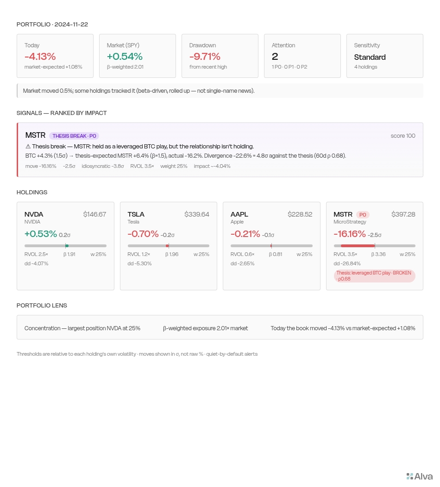
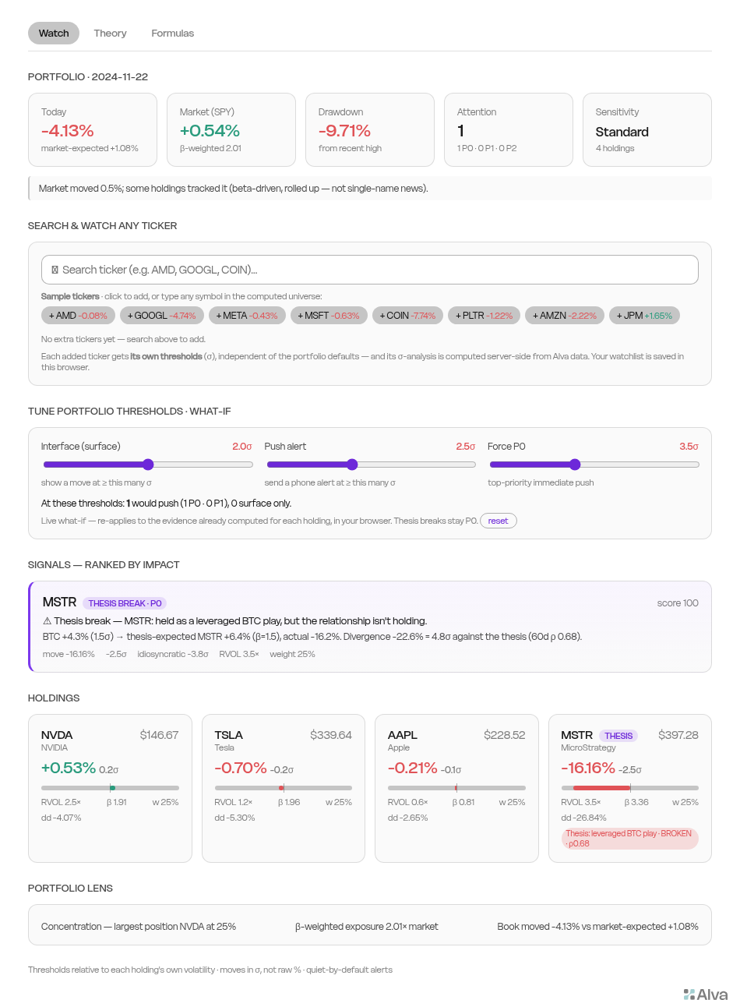

# Portfolio Watch Skill

[](https://github.com/george351419-sys/Portfolio-Watch-Skill/releases/latest)

A **Portfolio Watch Skill** for Alva: load it, hand it any portfolio, and get a
Playbook with a live interface and quiet, ranked alerts — it decides which
dimensions to watch, what's a real move vs noise, and how to rank signals, so it
works on a portfolio it has never seen.

> ⬇️ **Download & install:** grab [**`portfolio-watch-skill-v2.0.0.zip`** from the latest release](https://github.com/george351419-sys/Portfolio-Watch-Skill/releases/latest), unzip, and paste `SKILL.md` into Alva's Agent (it declares `builds_on: alva`). Then say *"watch my portfolio"*. Full steps in the release notes.

> 📋 **See [`DELIVERABLES.md`](DELIVERABLES.md)** for a one-glance status of everything shipped (3 required deliverables · 10 signal sources · live state · gaps).
>
> 🤖 **Agents & maintainers:** read **[`AGENTS.md`](AGENTS.md)** — architecture, Alva primitives, the hard-won storage/deploy gotchas, and a step-by-step guide to extend or optimize safely.

---

## ✨ Highlight — watch the *thesis*, not just the market

Most trackers tell you *"MSTR dropped 16%."* This one asks the more important
question: **"is the reason you bought it still true?"**

Load the Skill into Alva's Agent and just talk to it — *"watch my NVDA, TSLA,
AAPL"*, later *"also watch COIN"*, *"stop watching TSLA"*. The **watched set is a
live, user-owned config** — edit it by asking the Agent, **or right in the
Playbook UI** (search a ticker to add, ✕ a chip to remove — wired to a registered
UDF that writes your config **and computes the new ticker's σ-analysis on the
spot**, so it appears in Signals/Holdings immediately). Verified: 4 → +COIN →
−TSLA both ways; new names get auto-profiled. Then tell it *why* you hold
something — *"I hold MSTR as a leveraged BTC play"* — and it watches whether that
reason still holds. On **2024-11-21**,
Bitcoin rose **+4.3%** so MSTR *should* have risen ~+6% — instead it **crashed
−16%**, a gap **4.8× bigger than normal**. The buy-thesis broke, so it fires a
**top-priority (P0) alert that names the broken logic, not just the price** — and
tapping it deep-links to this exact card.



*Live Playbook · real MSTR/BTC data · alert delivered to Discord + web push. The clever part:
this reuses the same "ruler" the system already uses to spot unusual single-stock
moves — just pointed at Bitcoin instead of the market. Same thermometer, different
spot, completely different meaning. (Plain-language write-up in the
[One-Pager](One-Pager.md).)*

**How it scales:** you state the thesis or confirm a *proposed* one in one tap
(never interrogated per holding), and add more anytime. **This is live in the UI** —
an **"Arm a thesis"** card infers a likely buy-reason from each holding's sector and
lets you confirm it in one click; the reference can be any benchmark (BTC, SMH, QQQ,
SPY…), not just crypto. Most theses reduce to a
few reusable invariant shapes (relationship / ranking / correlation / level), so
new ones are added by parameters, not code — and a genuinely novel thesis is
compiled by the in-loop LLM into a monitorable proxy, honestly bounded by the data
that exists. See [`portfolio-watch/SKILL.md`](portfolio-watch/SKILL.md) §Thesis-Linked.

## 🔎 Also usable, not just smart

The Playbook is organized into three tabs — **Watch · Theory · Formulas** — so a
user sees the alerts, *and* the reasoning, *and* the exact formulas. On the Watch
tab you can **search any ticker and add it to your watchlist, each with its own
σ-thresholds**, and drag sliders to re-threshold the live evidence and watch
signals appear or clear in real time. The methodology and every parameter are
visible and adjustable — not a black box.



> **中文一句话**：一个可复用的 Portfolio Watch Skill——加载后对任意持仓生成"界面 + 智能告警"的 Playbook。亮点是**盯的不只是"市场发生了什么"，而是"你当初买入的理由还成立吗"**：把 MSTR 当"比特币放大版"持有，当比特币大涨而 MSTR 反而暴跌，说明买入逻辑破裂，直接越级 P0 告警。已在 Alva 上真 build、真推送、并用 5 年历史回测验证。

---

## 🧭 Methodology highlights — what makes it good (for adopters & remixers)

The full spec is one pasteable file, [`portfolio-watch/SKILL.md`](portfolio-watch/SKILL.md). The distinctive parts:

| Highlight | What it is | Where |
|---|---|---|
| **Information collection — cross-checking sources** | Price/volume · events & filings · **prediction markets (Polymarket)** · **smart money (insider/congress)** · **options-implied (IV/expected-move/skew)** · **crypto microstructure (perp funding/OI)** · **semiconductor cycle (DXI)**. Signal from corroboration, not one feed. | SKILL §Dimensions, §Thesis-Linked, Layer C |
| **Asset-class-specific benchmarks** | Each holding measured against the right ruler + endpoint: US stocks → SPY/sector-ETF (OLS β, residual vol); crypto & crypto-linked → BTC (spot + perp funding); ETFs → own bars; new listings → cold-start prior + HF bootstrap. | SKILL §Step 2, Appendix A |
| **Layered monitoring model** | A price · B events/filings · C information/narrative · D portfolio — plus portfolio-level **context overlays** (macro, sector, smart-money) that never add per-stock noise. | SKILL §Step 3 |
| **Three-check gate for a real move** | Statistically significant (own adaptive σ, t-quantile) → **idiosyncratic** (residual vs benchmark) → confirmed (volume/cause). | SKILL §Step 4 |
| **Noise-filtering rules** | β roll-up (10 alerts → 1), Benjamini–Hochberg FDR (q=0.10), hysteresis ratchet, continuation suppression, 10b5-1 & liquidity gates. | SKILL §Step 5 |
| **Multi-signal priority ranking** | 0–100 score `0.30·S + 0.25·I + 0.15·C + 0.10·η + 0.20·F − 0.40·P`, ranked by **impact on your money** not loudness; impact gate; tiers P0/P1/P2; same-ticker/same-cause merge; ≤4 P0 pushes/day. | SKILL §Step 6, `Strategy-Analysis.md` |
| **Thesis-linked dynamic loop** | Watch the *reason* you bought (price proxy or a catalyst event); a broken thesis escalates to P0. | SKILL §Thesis-Linked |

The same highlights are readable in-product on the Playbook's **Theory** tab, with the math on the **Formulas** tab.

## 🔁 Adopt or remix this

- **Use the Skill on your own portfolio:** paste [`portfolio-watch/SKILL.md`](portfolio-watch/SKILL.md) into the Alva chat (it's a single, self-contained file). If you've **linked a brokerage/crypto account** to Alva's Portfolio module, just say *"watch my portfolio"* — it reads your real positions (`alva portfolio summary`, TREX + SnapTrade) and monitors them at true weights, zero typing. No linked account? Say *"watch my NVDA, TSLA, AAPL."* Either way the watched set is a user-owned config you edit anytime (by chat or in the UI), and *"sync my portfolio"* diffs in new trades.
- **Remix the Playbook:** `alva remix` the live Playbook, or lift the feed/UI sources from [`playbook-src/`](playbook-src/) (`pw-profile.js`, `pw-watch.js`, `pw-index.html`, `updateWatchlist.js`, `holdings.json`).
- **Reuse a single capability:** the verified reference modules are standalone — `thesis-monitor.js`, `catalyst-thesis.js`, `alert-fusion.js`, `smart-money.js`, `options-signal.js`, `crypto-micro.js`.

---

## The three required deliverables

| # | Deliverable | Where |
|---|---|---|
| 1 | **The Skill** (single file + code) | [`portfolio-watch/`](portfolio-watch/) · packaged [`portfolio-watch-skill-v2.0.0.zip`](portfolio-watch-skill-v2.0.0.zip) |
| 2 | **A Playbook built from it** (interface + alerts live) | https://alva.ai/u/george351419/playbooks/portfolio-watch |
| 3 | **One-pager** on the thinking (bilingual + figures) | [`One-Pager.md`](One-Pager.md) |

## Suggested reading order (≈10 min)

1. **[`One-Pager.md`](One-Pager.md)** — the thinking in one page (EN + 中文, with figures). Start here.
2. **[`portfolio-watch/SKILL.md`](portfolio-watch/SKILL.md)** — the actual Skill: intake → per-holding baseline → 4-layer monitoring → three-check gate → noise filters → 0–100 ranking → interface → alerts → cold-start & latency.
3. **The live Playbook** (link above) — interface + a real delivered alert deep-linking back to the matching card.
4. **[`Strategy-Analysis.md`](Strategy-Analysis.md)** — the math底稿: adaptive baselines (EWMA/MAD), residual-vol z, t-thresholds, FDR, hysteresis, the scoring algebra, cold-start, alert fusion, and thesis-linked escalation (§7b).
5. **[`Backtest-Report.md`](Backtest-Report.md)** — historical replay & precision-recall calibration on 29 symbols (Mag7 + 20 untuned stocks + BTC/LTC), 37,837 days, **+ an ablation (§8.5): volume gate −26% alert volume at equal precision; thesis adds ~24% unique P0 coverage**.
6. **[`Evaluation-Matrix.md`](Evaluation-Matrix.md)** — one-glance honest status of every capability (Live / Verified / Backtested / Specced / Known-limitation) + tiered asset coverage. Read this to see exactly what's proven vs designed.

## Full file map

```
AGENTS.md                     Guide for AI agents & maintainers (architecture, gotchas, how to extend)
portfolio-watch-skill-v2.0.0.zip   Deliverable 1 — the packaged, self-contained Skill bundle
portfolio-watch/              Deliverable 1 (unzipped) — SKILL.md + README + scripts/{live,modules}
portfolio-watch/SKILL.md      the Skill (single, pasteable file)
One-Pager.md                  Deliverable 3 — one-pager (bilingual, embeds assets/fig1-3)
Strategy-Analysis.md          Math appendix — rigorous derivations (§7 = alert fusion)
alert-fusion.js               Reference implementation of Narrative Fusing + Silent Update
                              (self-test verified on Alva runtime: 3-event incident → 1 card)
thesis-monitor.js             Thesis-linked monitoring — a broken buy-thesis escalates to P0
                              (verified on real MSTR/BTC data: 2024-11-21 −4.6σ leverage-thesis break)
catalyst-thesis.js            Catalyst thesis via Polymarket — when the event you're betting on
                              gets priced out, the thesis breaks. Verified on real data AND wired live:
                              ITB held betting a Dec Fed cut, P(cut) 83%→60% → catalyst thesis strained (P1)
Backtest-Report.md            Precision-recall report, 3 rounds, per-cohort reusability
backtest/                     Reproducibility: runtime script + raw result JSONs
  pw-backtest.js              Alva runtime backtest (seed 20260705)
  results-29symbols-400d.json / results-9symbols-400d.json
assets/                       Figures fig1–fig6 + thesis-break-demo.png (the hero shot)
notes/                        Working trail (not deliverables)
  Monitoring-Strategy.md      First strategy draft (from initial research)
  SKILL_codex.md              A peer's version — its domain depth was absorbed into SKILL.md
.agents/ , skills-lock.json   Alva's OFFICIAL skill, installed via `npx skills add` (tooling, not mine)
```

## What actually got built on Alva (deliverable 2)

- **Two feeds** — `pw-profile` (adaptive per-holding baseline: EWMA/MAD vol, OLS β, residual vol σ_ε; cold-start prior) → `pw-watch` (residual-vol z-scores, FDR, hysteresis, bounded 0–100 scoring, quiet-by-default `notify/message`).
- **Interface** — **three tabs**: **Watch** (live dashboard + a **search box to add any ticker** to a watchlist — ~24 liquid names preview instantly, and any other symbol is added and profiled live via the UDF — each with **its own thresholds**), **Theory** (the plain-language why), and **Formulas** (the exact math). Plus **interactive threshold sliders** — drag the surface/push/force σ and the signals re-threshold live in your browser (the feed stores each holding's raw idiosyncratic evidence; thresholds are re-applied client-side). Live-read, deep-link anchors, passes `alva lint`.
- **Alert** — delivered end-to-end to **Discord + web push** (status = sent) with a deep link that lands on the matching card. Verified via `notification-history`.
- **Demo / Live toggle (instant)** — the header carries a **📌 Demo · 🔴 Live** switch that flips **instantly, client-side** (dual-snapshot: each mode has its own bucket, the UI just re-reads — no backend trigger, no sign-in). Demo pins the Playbook to the **2024-11-21/22** session so two real thesis signals show at once: **MSTR** (price thesis — BTC +4.3% but MSTR −16.2% → −4.8σ leverage-thesis break, P0) and **ITB** (catalyst thesis via Polymarket — P(Dec Fed cut) fell 83%→60% → strained, P1). Flip to **Live** for current-market data (verified: 2 P0 today). The watched set (NVDA/TSLA/AAPL/MSTR/ITB) is a live config.

## Reproducing the backtest

```
alva run --local-file backtest/pw-backtest.js --timeout-ms 550000 --max-heap-size-mb 768
```
(Requires an authed Alva CLI — `@alva-ai/toolkit`. Seed is fixed; windows are listed in the report.)

## Honesty notes

- The Playbook demo is at **daily cadence**; intraday/pre-market tightening lives in the Skill spec. Options/short-interest confirmers and per-sector fundamental templates are Skill capabilities the 3-stock demo doesn't fully exercise.
- Alerts are delivered to **Discord + web push** (verified, status = sent). Telegram/Slack use the identical pipeline (`feed_alert_ready` → `active_channel`), no code change. Telegram "Silent Update" (edit one card in place) is the one part needing a direct bot token (BYOD); its fusion **logic** is verified on the runtime, the editable-card **delivery** is documented and ready to wire.
- Backtest precision ≈ 0.33 at 2.5σ (lift ~1.3×) is a real but **modest** edge — forward continuation is a weak signal in efficient markets. The product's job is **noise suppression + attention routing**, not price prediction; the backtest quantifies exactly why the confirmation layers (volume/news) matter.
- All threshold parameters are **evidence-based starting points**, calibrated on historical replay and adjustable via the three sensitivity presets.
